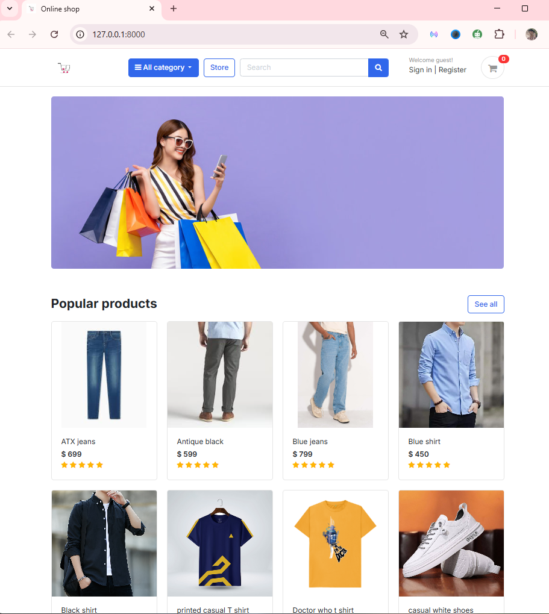
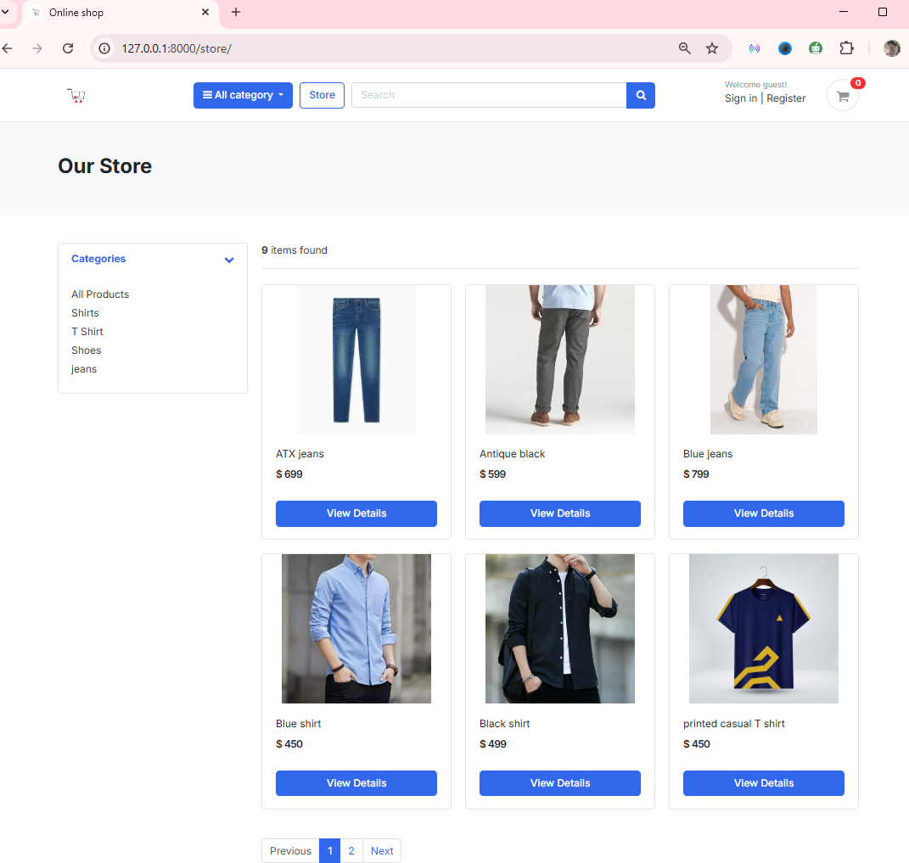
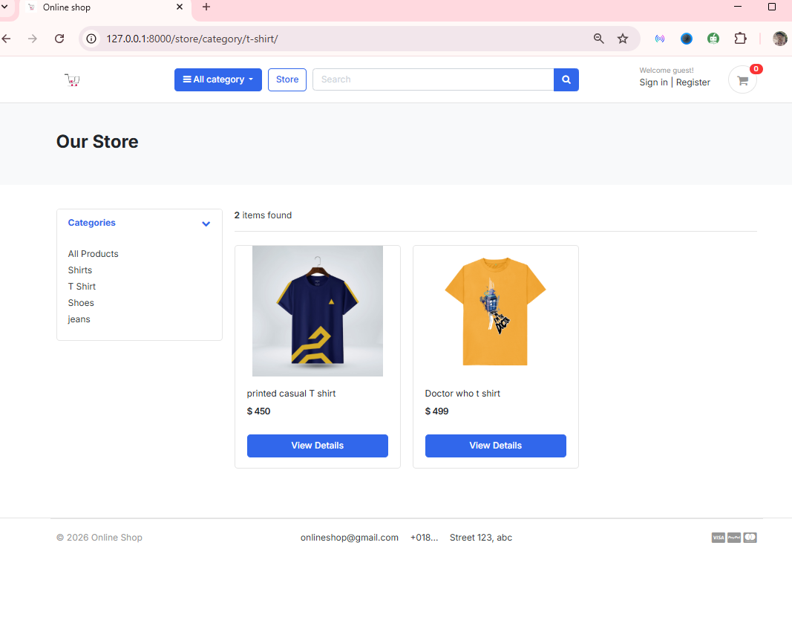
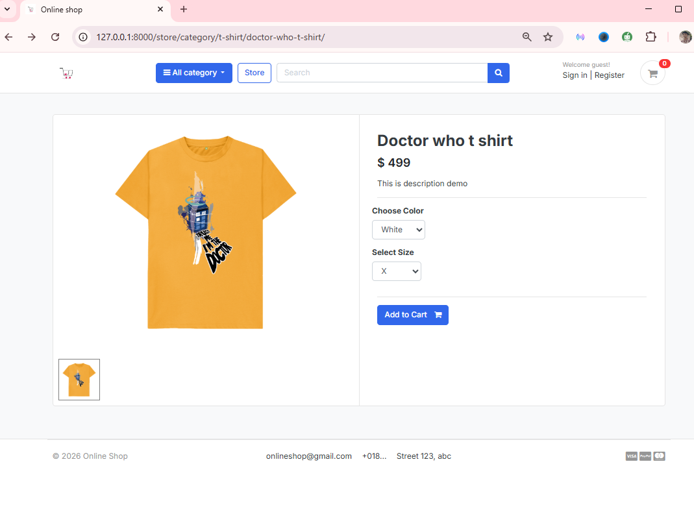
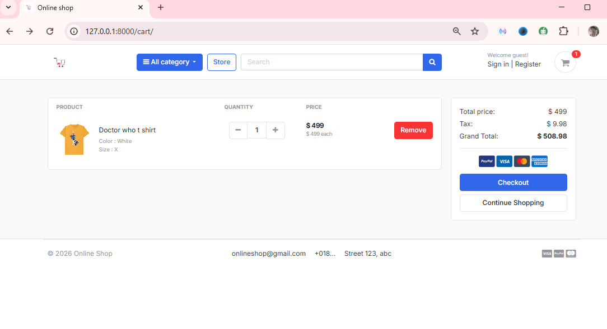

# 🛒 Online Shop

A fully functional e-commerce web application built with **Python** and **Django**, featuring product browsing, a shopping cart, user authentication, and category-based navigation.

---

## 📌 Features

- 🔐 **User Authentication** — Register, log in, and manage your account
- 🏪 **Product Store** — Browse and view detailed product listings
- 🗂️ **Category Navigation** — Filter and explore products by category
- 🛒 **Shopping Cart** — Add, update, and remove items from your cart
- 🖼️ **Media Uploads** — Product images managed via Django's media system
- 🎨 **Templated UI** — Clean HTML templates for a smooth user experience

---

## ER


---


## 🗂️ Project Structure

```
online_shop/
├── accounts/           # User registration, login, and profile management
├── carts/              # Shopping cart logic and views
├── category/           # Product category models and views
├── store/              # Core store app — products, listings, detail pages
├── templates/          # HTML templates for all views
├── media/
│   └── photos/         # Uploaded product images
├── online_shop/        # Django project settings and URL configuration
└── README.md
```

---

## 🛠️ Tech Stack

| Layer     | Technology          |
|-----------|---------------------|
| Backend   | Python, Django      |
| Frontend  | HTML, CSS           |
| Database  | SQLite (default)    |
| Media     | Django Media Files  |

---

## 🚀 Getting Started

### Prerequisites

- Python 3.8+
- pip

### Installation

1. **Clone the repository**
   ```bash
   git clone https://github.com/Shuvo018/online_shop.git
   cd online_shop
   ```

2. **Create and activate a virtual environment**
   ```bash
   python -m venv venv
   source venv/bin/activate       # On Windows: venv\Scripts\activate
   ```

3. **Install dependencies**
   ```bash
   pip install -r requirements.txt
   ```

4. **Apply database migrations**
   ```bash
   python manage.py makemigrations
   python manage.py migrate
   ```

5. **Create a superuser** *(for admin access)*
   ```bash
   python manage.py createsuperuser
   ```

6. **Run the development server**
   ```bash
   python manage.py runserver
   ```

7. **Visit the app** at [http://127.0.0.1:8000](http://127.0.0.1:8000)

---

## 🔧 Configuration

Update `online_shop/settings.py` as needed:

- `SECRET_KEY` — Replace with a secure secret key for production
- `DEBUG` — Set to `False` in production
- `ALLOWED_HOSTS` — Add your domain or IP
- `DATABASES` — Configure your preferred database (PostgreSQL recommended for production)
- `MEDIA_ROOT` / `MEDIA_URL` — Already set up for product image uploads

---

## 👤 User Roles

| Role     | Access                                      |
|----------|---------------------------------------------|
| Guest    | Browse products and categories              |
| User     | Register/login, manage cart, place orders   |
| Admin    | Full access via Django Admin panel (`/admin`) |

---

## 📸 Screenshots
<h2>Home page</h4>

<h2>store page</h4>

<h2>category page</h4>

<h2>product view page</h4>

<h2>cart items page</h4>



---

## 🙋‍♂️ Author

**Shuvo018**
- GitHub: [@Shuvo018](https://github.com/Shuvo018)
